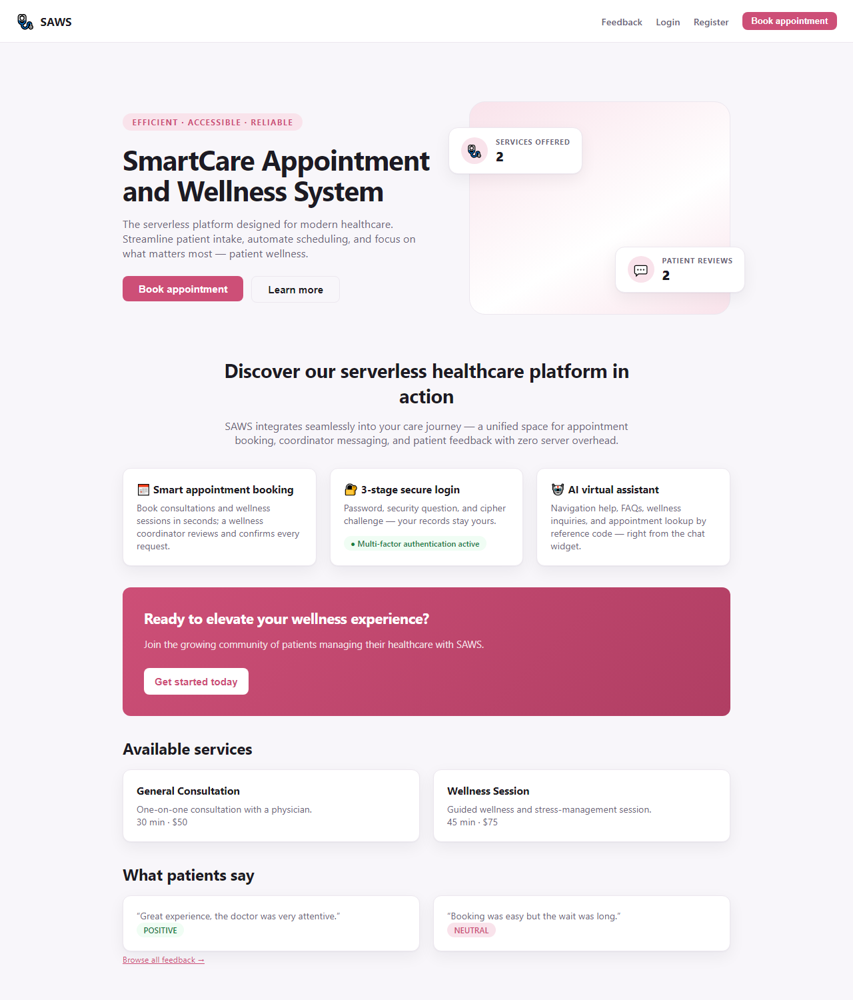
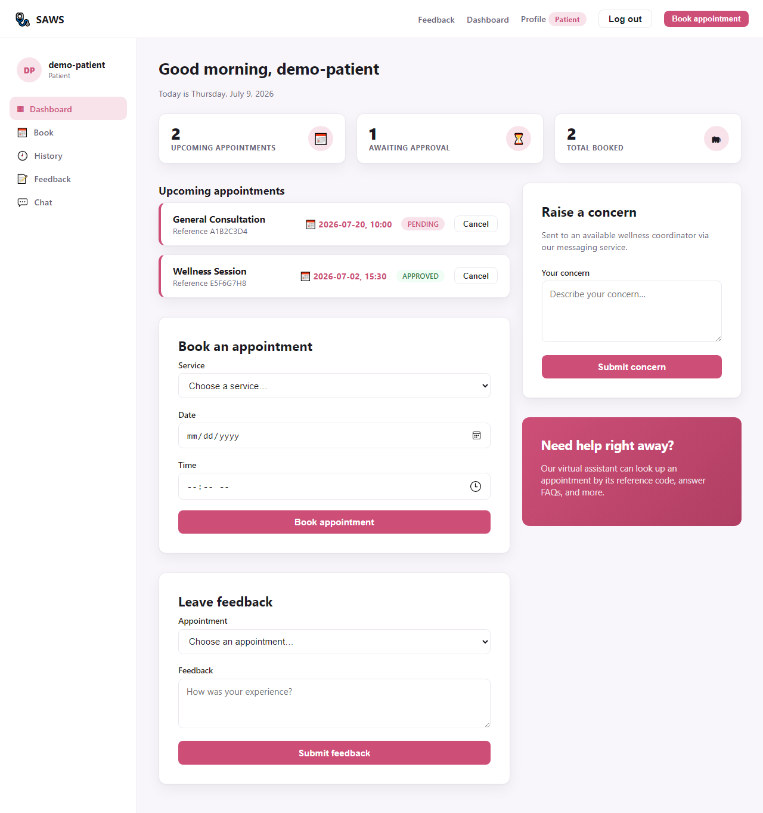
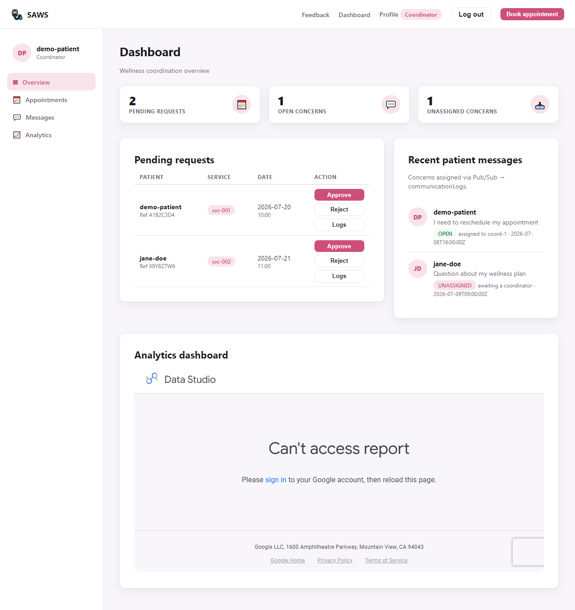
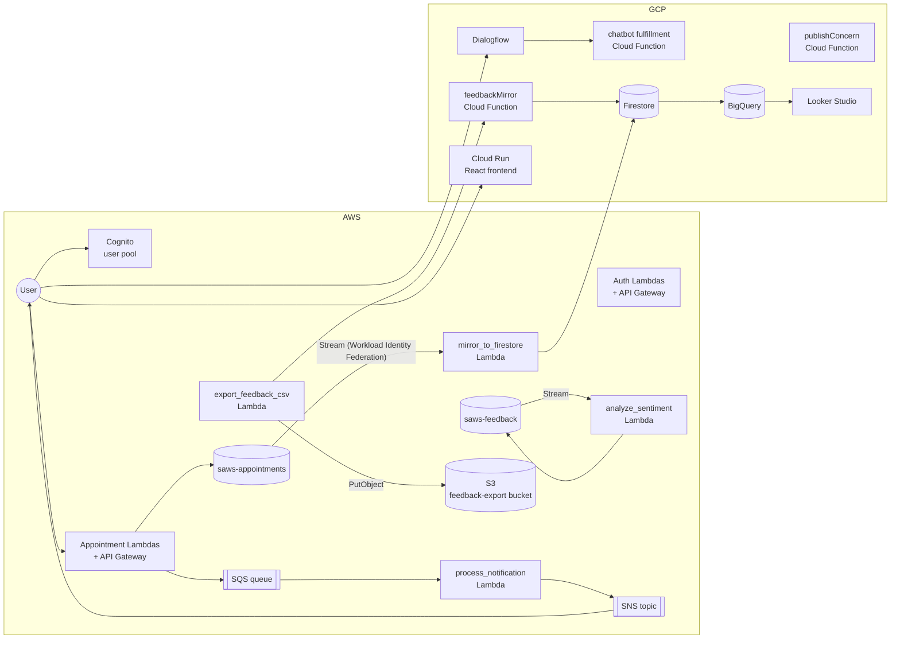

# SmartCare Appointment and Wellness System (SAWS)

A cloud-native, serverless healthcare appointment and wellness platform spanning **AWS and GCP**, built as a team capstone project for CSCI 5410 (Cloud Computing) at Dalhousie University.

[](#testing)
[](#testing)
[](infrastructure)
[](.gitlab-ci.yml)

> **About this repository:** the team's day-to-day development happened on a private Dalhousie
> GitLab instance, with full sprint-by-sprint commit history across 7 contributors. This repo is a
> personal portfolio export of that project — published as a single snapshot commit rather than the
> full history, both because the original history isn't mine alone to publish and because a few
> early commits contained data (test-account emails, a Terraform state backup) that shouldn't be
> public. The `.gitlab-ci.yml` pipeline described below is what ran in that private GitLab project;
> it isn't wired up here.

> **Project status:** feature-complete and fully tested locally. The live AWS deployment ran on an
> AWS Academy Learner Lab, whose credits/session have since expired, so the hosted demo is
> currently offline. Everything below — the code, the 150-test suite, and the Terraform/CloudFormation
> IaC — is real and runnable; see [Project Status](#project-status) for what that means in practice
> and the [evidence screenshots](#screenshots) for what it looked like live.

## Overview

SAWS lets patients discover wellness services, book and manage appointments, and get automated
reminders, while wellness coordinators triage requests and respond to patient messages. It supports
three user types — **Guests**, **Registered Patients**, and **Wellness Coordinators** — and is built
as six independently deployable modules split across two cloud providers on purpose, to demonstrate
cross-cloud integration (Cognito-authenticated calls into GCP, DynamoDB Streams mirrored into
Firestore, Workload-Identity-Federation service auth) rather than sticking to a single vendor.

## Features

- **Multi-stage authentication** — Cognito password login, then a security question and a
  personalized Caesar-cipher challenge, enforced server-side end to end (see
  [Module 1 security writeup](docs/sprint-reports/Module1-auth-security.md) for the MFA-bypass
  vulnerability that was found and fixed during hardening).
- **Appointment booking & lifecycle** — book, approve/reject, cancel, and audit-log every state
  change, with role-gated access enforced in Lambda, not just in the UI.
- **Wellness coordinator dashboard** — queue of pending requests, per-status filtering, and
  appointment history/logs.
- **Virtual assistant** — a Dialogflow chatbot embedded in the frontend for guest and patient FAQs.
- **Two-way messaging** — patients raise concerns via Pub/Sub-backed Cloud Functions; coordinators
  reply, with unassigned concerns auto-reassigned.
- **Automated notifications** — appointment events flow through SQS → Lambda → SNS for reminders
  and status alerts.
- **Feedback + sentiment analytics** — feedback is scored with a sentiment analysis pipeline,
  exported to CSV, mirrored into Firestore/BigQuery, and visualized in Looker Studio dashboards.

## Screenshots

Evidence captured against the live deployment (full set in
[docs/sprint-reports/evidence/frontend](docs/sprint-reports/evidence/frontend)):

| Guest landing | Patient dashboard | Coordinator dashboard |
|---|---|---|
|  |  |  |

## Architecture

Multi-cloud deployment, with two cross-cloud mirrors (appointments and feedback) keeping GCP-side
analytics in sync with AWS-side writes:

- **AWS**: Cognito, Lambda, API Gateway, DynamoDB (+ Streams), SQS, SNS, S3
- **GCP**: Dialogflow, Cloud Functions, Firestore, Pub/Sub, BigQuery, Cloud Run, Looker Studio



Full diagram with all data flows: [docs/architecture/architecture-diagram.md](docs/architecture/architecture-diagram.md).
Design rationale and trade-offs: [docs/architecture/architectural_decisions.md](docs/architecture/architectural_decisions.md).

## Modules

| # | Module | Cloud | Technologies |
|---|--------|-------|-------------|
| 1 | User Management & Authentication | AWS | Cognito, Lambda, DynamoDB |
| 2 | Virtual Assistant (Chatbot) | GCP | Dialogflow, Cloud Functions, Firestore |
| 3 | Message Passing | GCP | Pub/Sub, Cloud Functions, Firestore |
| 4 | Notifications | AWS | SQS, SNS, Lambda |
| 5 | Data Analysis & Visualization | GCP | Natural Language API, Looker Studio, BigQuery |
| 6 | Web App & Deployment | GCP / AWS | React, Cloud Run, Terraform, CloudFormation |

## Tech Stack

- **Frontend**: React 18, React Router, Axios, deployed as a container on Cloud Run
- **Backend**: Python 3.11 (AWS Lambda), Node.js 18 (GCP Cloud Functions)
- **Data**: DynamoDB, Firestore, BigQuery
- **Infra as Code**: Terraform (both clouds) + CloudFormation (AWS)
- **CI/CD**: GitLab CI (in the original private repo) — lint, `terraform validate`/`fmt`, full test
  suites, and a keyless (Workload Identity Federation) auto-deploy to Cloud Run on merge to `develop`

## Testing

150 tests, all currently passing locally, none requiring live cloud credentials (every AWS/GCP call
is stubbed at the boundary):

```bash
# Backend (Python) — 110 tests across 5 Lambda modules
cd backend/auth && pip install -r requirements.txt
python -m pytest ../../tests/auth -v          # repeat per module: appointments, services, feedback, notifications

# Cloud Functions (Node) — 40 tests across 4 packages
cd chatbot/functions && npm install && npx jest    # repeat per module: messaging, analytics, appointments
```

In the original private repo, the same suites ran automatically in CI on every merge request — see
[.gitlab-ci.yml](.gitlab-ci.yml) for the pipeline definition.

## Project Structure

```
saws/
├── frontend/              # React application (Cloud Run)
├── backend/               # AWS Lambda functions
│   ├── auth/              # Cognito login, MFA stages 2 & 3, profile
│   ├── appointments/      # booking, approval, history, Firestore mirror
│   ├── feedback/          # submission, sentiment scoring, CSV export
│   ├── notifications/     # SQS → SNS pipeline
│   └── services/          # wellness service catalog
├── chatbot/               # Dialogflow configs + Cloud Functions
├── messaging/             # GCP Pub/Sub + subscriber Cloud Functions
├── analytics/             # Sentiment pipeline + Looker dashboard configs
├── infrastructure/
│   ├── aws/               # CloudFormation + Terraform for AWS
│   └── gcp/               # Terraform + Deployment Manager for GCP
├── docs/                  # Architecture, ADRs, sprint reports, API contract
└── tests/                 # Python test suites, mirrored 1:1 to backend/
```

## Getting Started

Full walkthrough (prerequisites, AWS/GCP setup, Terraform apply order, Cloud Run deploy) is in
[docs/architecture/setup.md](docs/architecture/setup.md). Quick start for the frontend against a
running backend:

```bash
cd frontend
cp .env.example .env   # fill in API Gateway URLs / Cognito + Firebase config
npm install
npm start
```

Since the AWS backend isn't currently deployed (see below), running it end-to-end today requires
re-provisioning `infrastructure/aws` and `infrastructure/gcp` against your own AWS/GCP accounts.

## Project Status

This was built and demoed against a shared AWS Academy Learner Lab account, which is
time/credit-boxed and has since expired — the API Gateway endpoints and Cognito pool from the
demo period are no longer live. Nothing about the application itself is incomplete: all 150 tests
pass, the frontend builds cleanly, the Terraform/CloudFormation for both clouds is intact and
`terraform validate`-clean, and the [evidence screenshots](#screenshots) and
[sprint reports](docs/sprint-reports) document the working system as it ran. Reviving the live demo
is an infrastructure re-provisioning exercise (new Learner Lab or standard AWS account +
`terraform apply`), not further development.

## Documentation

- [Architecture diagram](docs/architecture/architecture-diagram.md) · [Architectural decisions](docs/architecture/architectural_decisions.md) · [ERD](docs/architecture/erd.md)
- [API contract](docs/api/api-contract.md)
- [Sprint reports](docs/sprint-reports) (per-module writeups, including the [auth security hardening](docs/sprint-reports/Module1-auth-security.md))
- [Test plans](docs/testing)

## Team & My Contribution

SAWS was built by a 7-person team over a semester-long sprint cycle (see
[Sprint Timeline](#sprint-timeline)). My primary ownership was **Module 1 — Authentication &
Security**: the 3-stage Cognito/security-question/Caesar-cipher login flow and its hardening
(including diagnosing and closing an MFA-bypass gap — see the writeup linked above), the
corresponding frontend auth pages (login/register/profile), the Terraform for the auth and frontend
stacks, and the auth test suite and test-case documentation.

I also contributed to **Module 2 — Virtual Assistant (Chatbot)**, owned primarily by another
teammate: a fix connecting the Dialogflow fulfillment function to the *real* AWS→Firestore
appointment-mirror data shape (it had been built against stub-shaped data — missing fields, raw IDs
instead of display names), correcting an NLU confidence threshold that was letting gibberish input
match the FAQ intent, and broadening the FAQ and WellnessInquiry training phrases (6→17 and 6→15)
with new Jest coverage.

## Branching Strategy (Original Repo)

The team's private GitLab repo followed:

- `main` — production-ready code only
- `develop` — integration branch
- `feature/<module-name>` — per-feature development
- `fix/<issue-id>` — bug fixes

## Sprint Timeline

| Sprint | Phase | Focus |
|--------|-------|-------|
| Sprint 1 | Planning | Architecture, repo setup, research |
| Sprint 2 | Development | Core modules implementation |
| Sprint 3 | Development | Integration, security hardening, testing |
| Sprint 4 | Closing | Final demo, documentation |
