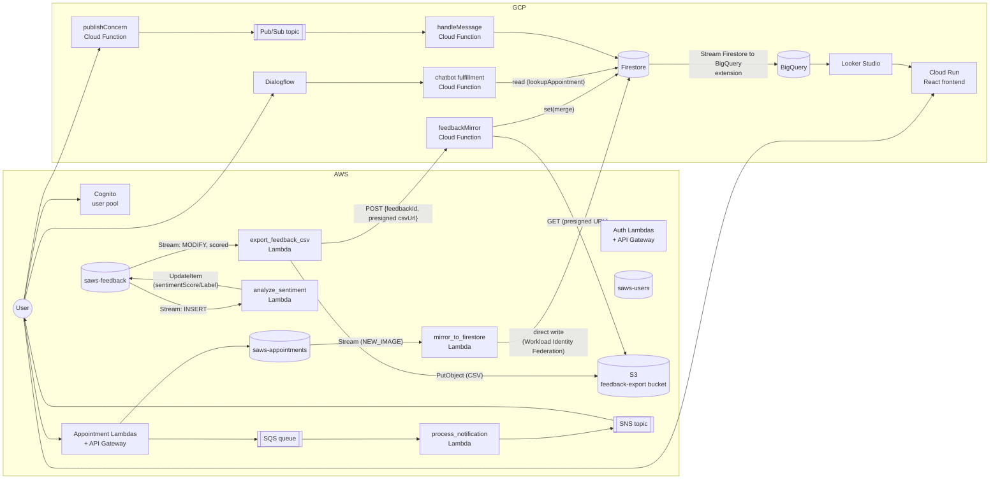
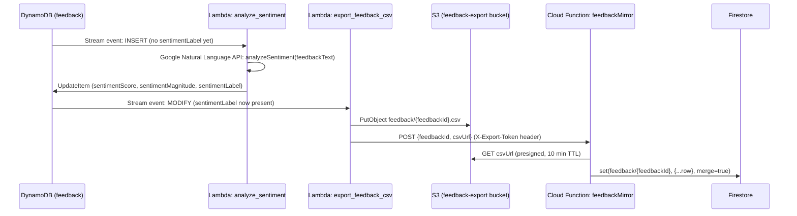

# Architecture Diagram — SAWS (Sprint 2)

No system diagram was ever committed to the repo (Sprint 1 meeting notes record one being
presented and "to be uploaded," but it isn't in this checkout — confirm with Akanksha/GitLab
before assuming this replaces rather than duplicates that one). This file is the diagram of
record going forward, built directly from the actual provisioned Terraform (`infrastructure/aws`,
`infrastructure/gcp`) and Lambda/Cloud Function source rather than the Sprint 1 proposal, so it
reflects what is really deployed, including the two cross-cloud mirrors.

## 1. Full system



## 2. The two cross-cloud mirrors, in detail

These are the seams identified as the system's highest-risk integration points
(`architectural_decisions.md` §4/§7/§9). Both start in AWS DynamoDB and end in GCP Firestore, but
they use different mechanisms because GCP cannot read DynamoDB directly:

```mermaid
sequenceDiagram
    participant D as DynamoDB (appointments)
    participant L as Lambda: mirror_to_firestore
    participant F as Firestore

    D->>L: Stream event (NEW_IMAGE)
    Note over L: Workload Identity Federation:<br/>AWS creds -> short-lived GCP token<br/>(no static key; org policy blocks key creation)
    L->>F: set(appointments/{id}, {refCode, date, service, status}, merge=true)
```



**Why the feedback mirror has an extra hop:** the appointments mirror can write to Firestore
directly because AWS Workload Identity Federation lets a Lambda exchange its own AWS credentials
for a short-lived GCP token — but that only gets the Lambda *into* GCP, it does nothing for the
reverse direction. There is no equivalent mechanism for a GCP Cloud Function to read DynamoDB
directly, and standing up a permanent cross-cloud credential either direction was the thing both
Option 1 (§4) and the mirror pattern itself were chosen specifically to avoid. Handing off a
CSV in S3 plus a short-lived presigned URL keeps the same "no standing cross-cloud secret"
property as the WIF-based appointments mirror, just running through an S3 object instead of a
GCP-native identity exchange.

## 3. Status

- Appointments mirror: implemented and tested (`backend/appointments/mirror_to_firestore.py`,
  `infrastructure/aws/terraform/appointments.tf`, `tests/appointments/test_mirror_to_firestore.py`).
  Already deployed (this is the mirror `saws-chatbot-fulfillment-dev`'s `lookupAppointment`
  reads from live).
- Feedback mirror, GCP half: **deployed and live-verified** in `serverless-project-501905`
  (`saws-feedback-mirror-dev`, deployed 2026-07-23 via a scoped `terraform apply -target` limited
  to the 3 new resources — the shared project also had unrelated pending drift on the
  chatbot/messaging functions and the Dialogflow agent's `time_zone`/logging settings that this
  deploy deliberately did not touch). Verified end to end: uploaded a throwaway CSV to a
  temporary GCS bucket, POSTed `{feedbackId, csvUrl}` to the live function URL, got `200 OK`, read
  back the resulting `feedback/FB-VERIFY-1` doc via the Firestore REST API and confirmed
  `sentimentScore`/`sentimentMagnitude` landed as numbers (not strings), then deleted the test doc
  and bucket. This is the real cross-cloud read hop working, not just the unit tests.
- Feedback mirror, AWS half: **not yet deployed** — `export_feedback_csv.py` and
  `feedback_export.tf` are implemented and tested (`tests/feedback/`), but no AWS credentials for
  this team's actual account were available to apply them from here. Until that happens, set
  `gcp_feedback_mirror_url = "https://saws-feedback-mirror-dev-hhuecvmxwq-uc.a.run.app"` in
  `infrastructure/aws/terraform/terraform.tfvars` and apply — see `setup.md` §"Integration
  Environment" for the full cross-cloud apply order. Until then the pipeline stops at S3 (Lambda
  logs "GCP_MIRROR_FUNCTION_URL not set" and skips the notify step rather than failing).
- Also fixed as part of this work: `infrastructure/gcp/terraform/main.tf`'s backend bucket was
  pointing at a bucket that doesn't exist (`saws-terraform-state-gcp`); real state lives in
  `serverless-project-501905-tfstate`. `terraform init` was silently starting a second, empty
  state for anyone using the committed config as-is — fixed so it now resolves to the real,
  already-deployed infrastructure.
