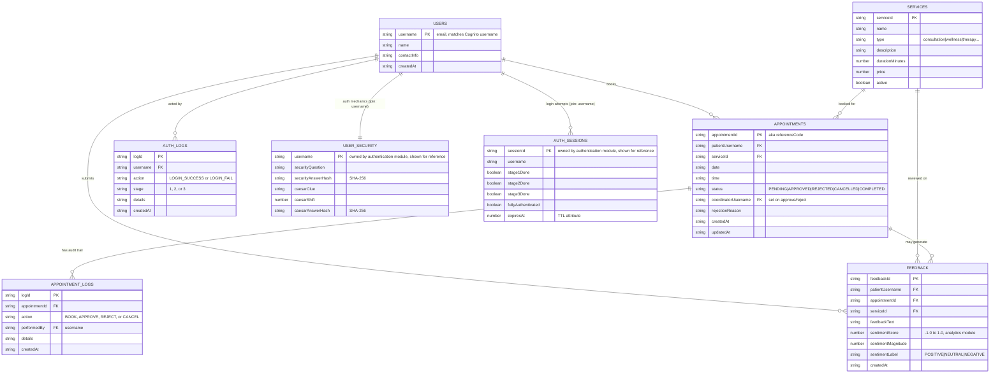

# Database Design / ERD — SAWS (Sprint 2)

**Status:** FINAL for Sprint 2. Users table fields confirmed with the authentication module
owner (see §2.1). Logs split into two tables per team decision (see §2.5, §2.6). All six tables
below are provisioned and live in AWS (see §4).

This document is the data model for the AWS side of SAWS (DynamoDB). It is the source both
the API contract (`docs/api/api-contract.md`) and the IaC (`infrastructure/aws/terraform/main.tf`,
`infrastructure/aws/cloudformation/main.yaml`) are derived from.

---

## 1. Entity-Relationship Diagram

Role is not modeled anywhere in this ERD: it is assigned at sign-up (a `postConfirmation`
Cognito trigger places the user into a `Patient` or `Coordinator` Cognito group) and travels
inside the ID token as a `cognito:groups` claim from then on. There is deliberately no `role`
column on any table, to avoid two disagreeing sources of truth.

---

## 2. Table-by-Table Design

Each entity gets its own DynamoDB table (per the Sprint 1 decision — one DynamoDB service,
individual tables, not separate DB instances — `architectural_decisions.md` §5). Keys and GSIs
below are driven by concrete access patterns needed by the authentication, booking/approval,
notifications, and analytics/feedback modules.

### 2.1 `saws-users-<env>` — exists since Sprint 1, redefined per authentication module agreement

| Key | Attribute | Type |
|---|---|---|
| PK (Hash) | `username` | String (email, matches Cognito username) |

No GSI needed — `username` is the partition key, and it is also the join key used by the
authentication module's own tables (below), so lookups never need a secondary index here.

This table carries **profile data only**: name, contact info, and any other patient/coordinator
business data. It does **not** carry `role`, `securityAnswer`, `cipherKey`, or a password —
those live only in the authentication module's tables or in Cognito, to avoid duplicating the
same field in two places with two different sources of truth. Note this is a change from the
Sprint 1 stub Lambdas (`backend/auth/stage2_security_qa.py`, `stage3_caesar_cipher.py`), which
read/wrote `securityAnswer`/`cipherKey` directly on this table keyed by `userId` — those stubs
will need to be pointed at the authentication module's `UserSecurity` table instead, keyed by
`username`.

#### Authentication module tables (reference only — provisioned by that module, not this ERD's scope)

| Table | Key | Purpose |
|---|---|---|
| `UserSecurity` | PK `username` | Stage 2 security Q&A and stage 3 Caesar cipher data — hashed answers only |
| `AuthSessions` | PK `sessionId` | Tracks per-login-attempt progress across the 3 stages; TTL on `expiresAt` auto-cleans abandoned sessions |

These two tables are documented here for completeness since they share the `username` join key
with `saws-users`, but they are owned and provisioned by the authentication module, not part of
this Sprint 2 IaC change.

### 2.2 `saws-appointments-<env>` — exists since Sprint 1, extended

| Key | Attribute | Type |
|---|---|---|
| PK (Hash) | `appointmentId` | String |

| GSI | Hash | Range | Purpose |
|---|---|---|---|
| `patientUsername-index` | `patientUsername` | — | Patient views own appointment history (renamed from `patientId-index` per §2.1) |
| `status-date-index` | `status` | `date` | **New.** Coordinator queue: list `PENDING` appointments sorted by date, for the booking module's approve/reject flow |

### 2.3 `saws-services-<env>` — exists since Sprint 1, unchanged

| Key | Attribute | Type |
|---|---|---|
| PK (Hash) | `serviceId` | String |

Small catalog, read in full (`Scan`) or by id. No new GSI needed.

### 2.4 `saws-feedback-<env>` — new

| Key | Attribute | Type |
|---|---|---|
| PK (Hash) | `feedbackId` | String |

| GSI | Hash | Purpose |
|---|---|---|
| `patientUsername-index` | `patientUsername` | Patient's own feedback history |
| `serviceId-index` | `serviceId` | Per-service feedback for the analytics dashboards |

### 2.5 `saws-auth-logs-<env>` — new

| Key | Attribute | Type |
|---|---|---|
| PK (Hash) | `logId` | String (UUID) |

| GSI | Hash | Range | Purpose |
|---|---|---|---|
| `username-index` | `username` | `createdAt` | Full login history for one user, ordered by time — satisfies the successful/failed authentication evidence requirement |

Written by the authentication module: one row per login attempt (`LOGIN_SUCCESS` or
`LOGIN_FAIL`), tagged with which of the 3 stages it happened at.

### 2.6 `saws-appointment-logs-<env>` — new

| Key | Attribute | Type |
|---|---|---|
| PK (Hash) | `logId` | String (UUID) |

| GSI | Hash | Range | Purpose |
|---|---|---|---|
| `appointmentId-index` | `appointmentId` | `createdAt` | Full decision history for one appointment, ordered by time |

Written by the booking/approval module: one row per status change (`BOOK`, `APPROVE`,
`REJECT`, `CANCEL`). Satisfies the appointment audit-trail commitment in
`architectural_decisions.md` §5.

Neither table above is the same thing as the patient-coordinator concern/chat logs from
Module 3 in the requirement document — those live in Firestore (`communication-logs`
collection), are owned by the messaging module, and are already documented in
`docs/sprint-reports/Module3-messaging.md`. No DynamoDB table is needed for that part.

---

## 3. GCP-Side Collections (Firestore) — reference only, not this ERD's scope

Documented elsewhere, listed here so the full data picture is in one place:

| Collection | Owner | Source doc |
|---|---|---|
| `appointments` (thin mirror) | cross-cloud seam | `architectural_decisions.md` §4 |
| `coordinators`, `communication-logs` | messaging module | `Module3-messaging.md` |
| `feedback` (sentiment mirror for Looker Studio via BigQuery) | analytics module | `Module5-sentiment-dashboards.md` |
| `loginEvents` (deferred from Sprint 1) | analytics module | `Module5-sentiment-dashboards.md` |

---

## 4. Status

- IaC for all six tables above is in `infrastructure/aws/terraform/main.tf` and
  `infrastructure/aws/cloudformation/main.yaml`.
- All six tables have been created and verified `ACTIVE` via `terraform apply` in a Learner Lab
  AWS account, with keys and GSIs matching this document.
- The API contract derived from this data model is in `docs/api/api-contract.md`.
- Outstanding: the authentication module's `UserSecurity`/`AuthSessions` tables (provisioned
  separately, not part of this Sprint 2 IaC change) and pointing the Sprint 1 stub Lambdas
  (`backend/auth/stage2_security_qa.py`, `stage3_caesar_cipher.py`) at the correct tables/keys —
  both owned by the authentication module.
