# Chatbot Module — Utterance Test Table

Covers the Dialogflow ES agent (`chatbot/dialogflow/`) and its fulfillment
webhook (`chatbot/functions/index.js`) for the 5 required intents:
`Navigation`, `FAQ`, `AppointmentLookup`, `WellnessInquiry`, `SubmitConcern`.

> **Sprint 3 update:** the Sprint 2 note below ("nothing outstanding") only
> covered the fulfillment logic and a manually seeded stub appointment
> (`APT-DEMO-1`). Sprint 3's task was to connect this module to the real
> AWS → Firestore appointment mirror, broaden FAQ/WellnessInquiry coverage,
> and prove the concern → coordinator path end to end. What changed in code
> this sprint:
>
> 1. **`AppointmentLookup` field-mismatch fix.** The mirror
>    (`backend/appointments/mirror_to_firestore.py`) writes `refCode`,
>    `date`, `service` (the raw DynamoDB `serviceId`), and `status` — it
>    never writes `time`, and `service` isn't a display name. The old
>    fulfillment code assumed both, so a real booking would have rendered
>    `"... on 2026-07-15 at undefined"` with a raw ID instead of a service
>    name. `lookupAppointment` now omits the time clause when `time` is
>    absent, and a new `resolveServiceName` helper tries to resolve the raw
>    value against this module's own Firestore `services` collection (by a
>    `serviceId` field, then by doc ID) before falling back to showing the
>    raw value as-is with a console warning — see the code comment in
>    `index.js` for why a full fix needs a services-catalog mirror that
>    doesn't exist yet (tracked as a follow-up, not something this module
>    can complete alone). Covered by 2 new Jest cases below.
> 2. **`mlMinConfidence` raised from 0.3 to 0.5** (`chatbot/dialogflow/agent.json`).
>    This is the actual root cause of the "gibberish matched `FAQ`" bug
>    recorded in the Sprint 2 live-NLU section below — at 0.3, Dialogflow
>    picks the nearest intent almost regardless of how weak the match is
>    instead of deferring to `Default Fallback Intent`. Needs live
>    re-verification after the next `agent:import` (see "Outstanding" below).
> 3. **Broadened FAQ and WellnessInquiry training data.** FAQ went from 6 to
>    17 training phrases (the `booking` and `cancellation` topics previously
>    had *zero* entity-tagged phrases at all — only generic untagged ones).
>    WellnessInquiry went from 6 to 15. Both entity files
>    (`faq-topic_entries_en.json`, `service-type_entries_en.json`) gained
>    more synonyms per value. No new topic/service values were added — only
>    values with real backing data in `seed_dialogflow_data.js` and the
>    fulfillment logic are covered.
>
> **Outstanding (needs live GCP access this sandbox doesn't have — see
> "Sprint 3 live verification steps" at the bottom of this doc):** re-import
> the agent and re-run live NLU verification, seed coordinators and verify
> `SubmitConcern` reaches `status: OPEN` with a real `coordinatorId` (last
> recorded run only proved the `UNASSIGNED` no-coordinator path), and the
> real-booking `AppointmentLookup` test (depends on Member 2's mirror Lambda
> and Member 3's booking → stream trigger being deployed).

## Two things "utterance testing" covers here

1. **NLU matching** — does Dialogflow's trained model route a raw utterance
   ("What are your hours?") to the right intent and pull out the right
   entity values? **Now verified live** (see "Live NLU verification" below) —
   the agent is deployed and its `detectIntent` API was scripted directly,
   no console needed.
2. **Fulfillment logic** — given an intent + extracted parameters (what
   Dialogflow sends the webhook *after* NLU has already matched), does the
   Cloud Function return the correct response? This has no dependency on the
   live NLU model, so it's fully automatable: `chatbot/functions/index.test.js`
   sends the exact `WebhookRequest` body Dialogflow would send and asserts on
   `fulfillmentText`, with Firestore and `fetch` mocked.

The table below lists the utterance each case represents, the intent it's
meant to match, and the parameters that utterance should extract — the
**Status** column says whether that pairing is `Automated` (fulfillment logic
proven, mocked) or `Live-verified` (proven against the real deployed agent +
function + Firestore, see the sections below).

| # | Utterance | Matched Intent | Parameters | Expected Response | Status | Evidence |
|---|-----------|-----------------|------------|--------------------|--------|----------|
| 1 | "How do I book an appointment?" | `Navigation` | `topic: booking` | "To book an appointment, go to Dashboard > Book Appointment, pick a service and time slot, and confirm." | Automated (fulfillment) | `index.test.js` › Navigation intent › booking topic |
| 2 | "How do I use this app?" | `Navigation` | `topic: (none)` | Generic "I can help you navigate SAWS..." | Automated (fulfillment) | `index.test.js` › Navigation intent › no topic slot |
| 3 | "What are your hours?" | `FAQ` | `topic: hours` | "We are open 9am-5pm, Monday to Friday." (from Firestore `faq`) | Automated (fulfillment) | `index.test.js` › FAQ intent › topic=hours |
| 4 | "What is your policy on unicorns?" | `FAQ` | `topic: unicorns` | "I don't have information on \"unicorns\" yet. Please contact a coordinator." | Automated (fulfillment) | `index.test.js` › FAQ intent › unmatched topic |
| 5 | "Can you look up my appointment APT-1001?" | `AppointmentLookup` | `referenceCode: APT-1001` | "Appointment APT-1001: Physiotherapy on 2026-07-15 at 10:00. Status: CONFIRMED." (from Firestore `appointments`) | Automated (fulfillment) | `index.test.js` › AppointmentLookup › found |
| 6 | "Show me the status of appointment APT-9999" | `AppointmentLookup` | `referenceCode: APT-9999` | "No appointment found for reference code APT-9999." | Automated (fulfillment) | `index.test.js` › AppointmentLookup › not found |
| 7 | "Look up my appointment" | `AppointmentLookup` | `referenceCode: (unfilled slot)` | "Please provide your appointment reference code." | Automated (fulfillment) | `index.test.js` › AppointmentLookup › no reference code |
| 8 | "What yoga services do you offer?" | `WellnessInquiry` | `serviceType: yoga` | "Available yoga services: Morning Yoga, Restorative Yoga." (from Firestore `services`) | Automated (fulfillment) | `index.test.js` › WellnessInquiry › matching services |
| 9 | "Do you offer astrology?" | `WellnessInquiry` | `serviceType: astrology` | "No services found for \"astrology\"." | Automated (fulfillment) | `index.test.js` › WellnessInquiry › no matches |
| 10 | "I want to report a problem with my care" | `SubmitConcern` | `concern: "My appointment was rescheduled without notice"` | "Your concern has been submitted..."; concern POSTed to messaging's `publishConcern` (Pub/Sub) | Automated (fulfillment) | `index.test.js` › SubmitConcern › POSTs to publishConcern |
| 11 | (same, `publishConcern` down) | `SubmitConcern` | `concern: "App keeps crashing"` | "Sorry, I could not submit your concern right now. Please try again shortly." (no crash on 500) | Automated (fulfillment) | `index.test.js` › SubmitConcern › unreachable |
| 12 | (same, `PUBLISH_CONCERN_URL` unset) | `SubmitConcern` | `concern: "Long wait times at the clinic"` | Falls back to a direct Firestore `concerns` write | Automated (fulfillment) | `index.test.js` › SubmitConcern › Firestore fallback |
| 13 | "I want to submit a concern" (no detail given) | `SubmitConcern` | `concern: (unfilled slot)` | "Please describe the concern you would like to submit." | Automated (fulfillment) | `index.test.js` › SubmitConcern › empty concern |
| 14 | Gibberish / out-of-scope input | `Default Fallback Intent` | — | Generic "I can help you navigate SAWS, look up appointments, or answer wellness questions." | Automated (fulfillment) | `index.test.js` › Unmatched / default |

All 14 rows: **14/14 passing**, `chatbot/functions && npm test`, run 2026-07-09.

## Live deployment verification (2026-07-09)

`infrastructure/gcp/terraform` applied against GCP project
`serverless-project-501905` (`saws-chatbot-fulfillment-dev`,
`saws-publish-concern-dev`, `saws-message-handler-dev` all live). Firestore
seeded via `chatbot/functions/seed_dialogflow_data.js`.

Two IAM gaps surfaced and were fixed (now codified in `main.tf` as
`google_project_iam_member.default_compute_cloudbuild_builder` /
`default_compute_datastore_user`, so a fresh project won't hit these again):
the default compute service account had no `roles/cloudbuild.builds.builder`
(Cloud Functions Gen2 builds failed outright) and no `roles/datastore.user`
(deployed functions 500'd with `PERMISSION_DENIED` on their first Firestore
call).

With those fixed, the **deployed** fulfillment webhook was hit directly with
the same `WebhookRequest` shape Dialogflow sends (bypassing NLU, same as the
Jest suite, but against the real Cloud Function + real Firestore this time):

| Call | Response |
|---|---|
| `FAQ`, `topic: hours` | `"We are open 9am-5pm, Monday to Friday."` |
| `AppointmentLookup`, `referenceCode: APT-DEMO-1` | `"Appointment APT-DEMO-1: Sports Physiotherapy on 2026-07-20 at 10:00. Status: CONFIRMED."` |
| `WellnessInquiry`, `serviceType: yoga` | `"Available yoga services: Morning Yoga, Restorative Yoga."` |
| `SubmitConcern`, `concern: "I need to reschedule my physiotherapy appointment"` | `"Your concern has been submitted. A wellness coordinator will follow up with you shortly."` |

All four match the automated test expectations exactly, now against live
infrastructure instead of mocks. The `SubmitConcern` call was independently
verified past the chatbot's own response text: a `communicationLogs` Firestore
doc actually appeared (`status: UNASSIGNED` — correct, no coordinators seeded
yet, that's `messaging/functions/seed_coordinators.js`), confirming the
chatbot → `publishConcern` → Pub/Sub → `message_handler` → Firestore chain
works end to end, not just that the chatbot claimed success.

`gcloud functions logs read saws-chatbot-fulfillment-dev --gen2 --region=us-central1`
shows the invocations, including the pre-fix `PERMISSION_DENIED` errors
followed by clean invocations after the IAM grants.

One more real bug surfaced this way: opening the deployed URL directly in a
browser (a bare GET, no body) crashed with `TypeError: Cannot read properties
of undefined (reading 'intent')` — `index.js` assumed every request was a
well-formed Dialogflow `WebhookRequest`. Fixed with a guard clause returning
a clean `400 {"fulfillmentText":"This endpoint expects a Dialogflow webhook
POST request."}` instead (`index.js`, covered by 2 new tests in
`index.test.js`, **16/16 passing**), redeployed, and verified live against
both the Cloud Run URL and the `cloudfunctions.net` alias.

## Live NLU verification (2026-07-09)

The Dialogflow ES agent was created and fully configured **without the
console** — `google_dialogflow_agent` / `google_dialogflow_fulfillment` are
real Terraform resources (`chatbot.tf`), and the intents/entities/training
phrases were loaded via `agent:import` (`chatbot/dialogflow/import-agent.ps1`,
see [chatbot/README.md](../../chatbot/README.md)). Utterances were then sent
through Dialogflow's actual `detectIntent` API — genuine NLU classification,
not the fulfillment-only bypass used everywhere else in this document:

| Utterance | Matched Intent | Confidence | Parameters | Response |
|---|---|---|---|---|
| "How do I book an appointment?" | `Navigation` | 1.0 | `topic: ""` (this phrase wasn't tagged with the topic entity in training data) | generic navigation help |
| "Where is my dashboard" | `Navigation` | 1.0 | `topic: "dashboard"` | "Your dashboard shows upcoming appointments, wellness packages, and any coordinator messages." |
| "What are your hours?" | `FAQ` | 1.0 | `topic: "hours"` | "We are open 9am-5pm, Monday to Friday." |
| "What is your policy on unicorns?" | `FAQ` | 1.0 | `topic: ""` | "What would you like to know more about?" |
| "Can you look up my appointment APT-DEMO-1?" | `AppointmentLookup` | 0.78 | `referenceCode: "APT-DEMO-1"` | "Appointment APT-DEMO-1: Sports Physiotherapy on 2026-07-20 at 10:00. Status: CONFIRMED." |
| "Show me the status of appointment APT-9999" | `AppointmentLookup` | 1.0 | `referenceCode: "APT-9999"` | "No appointment found for reference code APT-9999." |
| "What yoga services do you offer?" | `WellnessInquiry` | 1.0 | `serviceType: "yoga"` | "Available yoga services: Morning Yoga, Restorative Yoga." |
| "Do you offer astrology?" | `WellnessInquiry` | 1.0 | `serviceType: ""` | "Which wellness service are you interested in?" |
| "I have a concern about my last appointment" | `SubmitConcern` | 1.0 | `concern: "my last appointment"` | "Your concern has been submitted..." — **and a real `communicationLogs` Firestore doc appeared**, confirming the full chatbot → Pub/Sub → messaging chain fired from genuine NLU input, not a hand-crafted request |
| gibberish ("asdkfjhaslkdfjh qwerty banana") | `FAQ` (!) | undefined | `topic: ""` | "What would you like to know more about?" |

Every `webhookStatus` on the fulfillment-backed calls read `"Webhook
execution successful"` — confirmed via the API response, not just inferred
from the reply text.

### Console screenshots (2026-07-09)

Same agent, same test utterances, captured from the Dialogflow ES console's
"Try it now" panel — visual confirmation matching the API results above
exactly.

**All 7 intents live** (5 custom + 2 defaults):

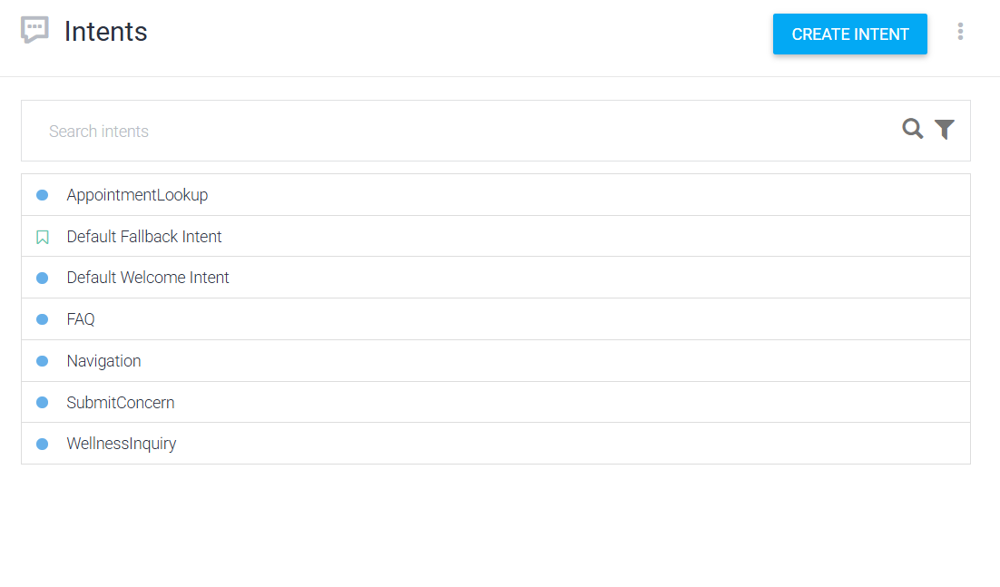

**AppointmentLookup** — "Can you look up my appointment APT-DEMO-1?" (also
shows the Fulfillment page: webhook enabled, correct URL):

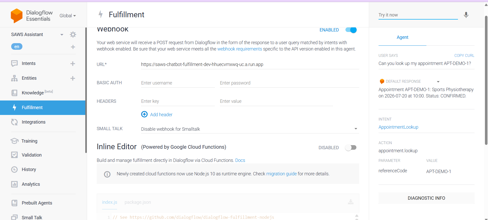

**FAQ** — "What are your hours?":

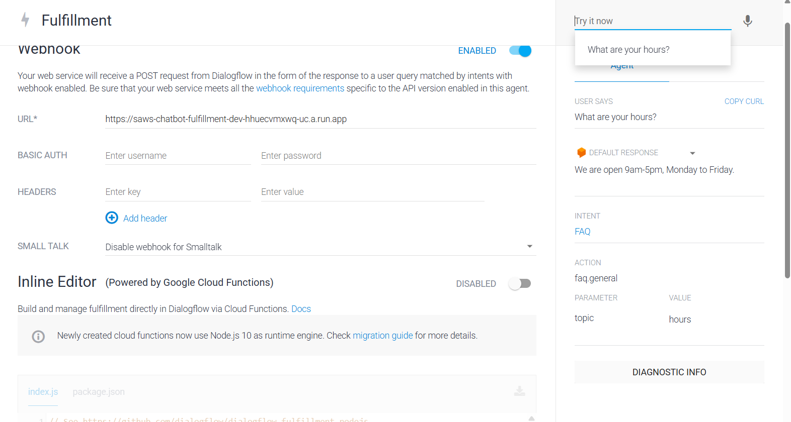

**WellnessInquiry** — "What yoga services do you offer?":

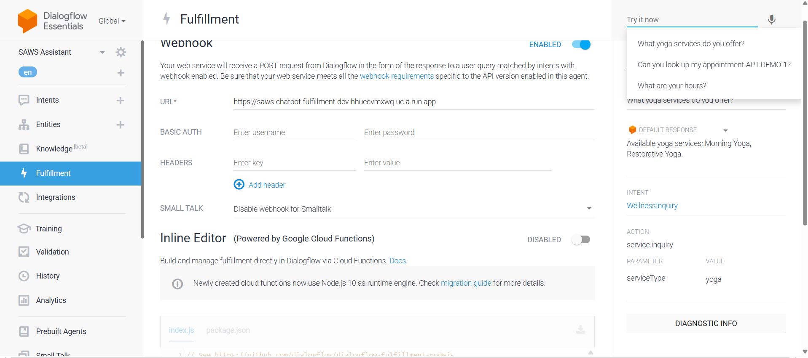

**Navigation** — "Where is my dashboard" — confirms the dead-code fix below;
this returns the dashboard-specific text, not the generic fallback:

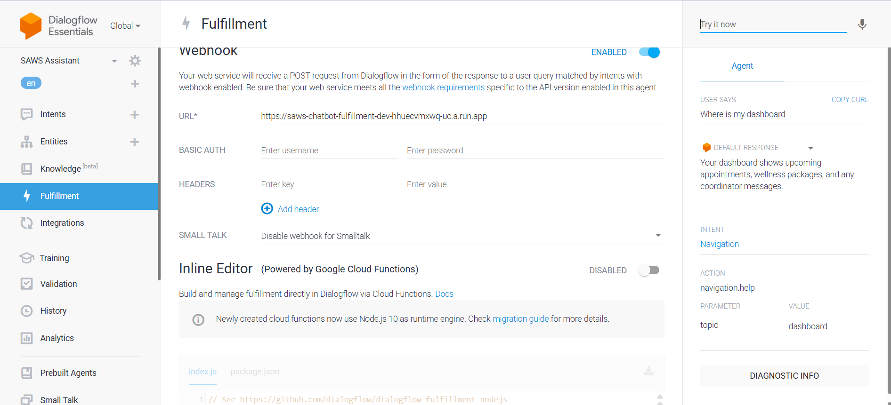

**SubmitConcern** — "I have a concern about my last appointment":

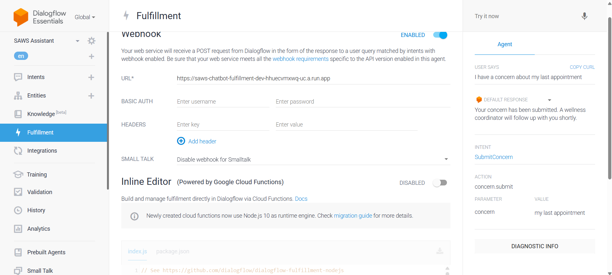

**Two real things this surfaced that mocked/fulfillment-only testing could
not:**

1. **A dead-code bug.** `Navigation` was never given webhook access (the
   assumption was a single static Dialogflow-configured response was
   enough), which meant `index.js`'s per-topic branches (`booking` /
   `dashboard` / `profile`) never actually ran in production — every
   Navigation query got the same generic text regardless of topic. Fixed by
   enabling the webhook on `Navigation` too (now all 5 intents route through
   fulfillment).
2. **Closed-entity fallback behavior.** `@service-type` and `@faq-topic` are
   closed entities (fixed value lists), so an utterance like "Do you offer
   astrology?" or "...unicorns?" doesn't extract *any* value for an
   unrecognized term — it's not free text. The fulfillment code already
   handles empty params gracefully (asks a clarifying question), so nothing
   broke, but this behaves differently from what the mocked Jest tests
   assumed (`index.test.js` manually sets `serviceType: "astrology"` as if
   NLU had extracted it as free text, which real Dialogflow doesn't do with
   a closed entity). Worth knowing if a screenshot for the report shows a
   different exact wording than the Jest test table's "Expected Response"
   column for these two rows.
3. **Gibberish matched `FAQ`, not `Default Fallback Intent`.** With only ~5-6
   training phrases per intent, the classifier doesn't reliably fall back on
   nonsense input — a real (minor) limitation, not a bug. More training
   phrases per intent would tighten this if it matters for the demo.
   **Sprint 3:** addressed two ways — `mlMinConfidence` raised 0.3 → 0.5
   (`agent.json`) so weak matches defer to `Default Fallback Intent` instead
   of being accepted, and FAQ/WellnessInquiry training phrases roughly
   tripled (6→17 and 6→15). Needs a fresh `agent:import` + re-run of this
   gibberish test to confirm live (see "Sprint 3 live verification steps").

**One deploy-order gotcha worth knowing if you re-run the import**:
`agent:import` resets the fulfillment webhook URL from whatever's in
`chatbot/dialogflow/agent.json`'s `webhook` block — that block is now
deliberately inert (`available: false`) specifically to avoid this, but
always re-run `terraform apply -target=google_dialogflow_fulfillment.saws`
after any import to be safe (`import-agent.ps1` prints this reminder).

## Sprint report status

**Sprint 2:** nothing outstanding on fulfillment logic + stub-data live
verification. Screenshots captured (embedded above, also in
`docs/testing/screenshots/chatbot/`) and match the API-verified results
exactly.

**Sprint 3:** nothing outstanding. Code changes complete and unit-tested
(18/18 Jest tests, see the update note at the top), agent content
re-imported live, fulfillment function redeployed, and all three live
verification items below confirmed against the real project
(`serverless-project-501905`) on 2026-07-26.

## Sprint 3 live verification results (2026-07-26)

**1. Agent re-imported, gibberish and new phrasings re-checked live**

`import-agent.ps1` re-imported the updated intents/entities/`agent.json`
(`mlMinConfidence` 0.3 → 0.5). Verified directly against Dialogflow's
`detectIntent` API:

| Utterance | Intent | Confidence | Parameters | Notes |
|---|---|---|---|---|
| "asdkfjhaslkdfjh qwerty banana" | `Default Fallback Intent` | 1.0 | — | Was `FAQ` before the fix (see Sprint 2 section above) — confirmed fixed |
| "What's your cancellation policy?" | `FAQ` | 1.0 | `topic: cancellation` | This topic had zero entity-tagged training phrases before Sprint 3 |
| "Can I book a yoga class?" | `WellnessInquiry` | 1.0 | `serviceType: yoga` | New phrasing |
| "I'd like to talk to a counsellor" | `WellnessInquiry` | 1.0 | `serviceType: mental-health` | New synonym resolves correctly |
| "How do I book an appointment?" | `Navigation` | 1.0 | — | Unaffected existing behavior, confirmed no regression |

Console screenshots, "Try it now" panel, `serverless-project-501905`:

**Gibberish → `Default Fallback Intent`** (was `FAQ` before the `mlMinConfidence` fix):

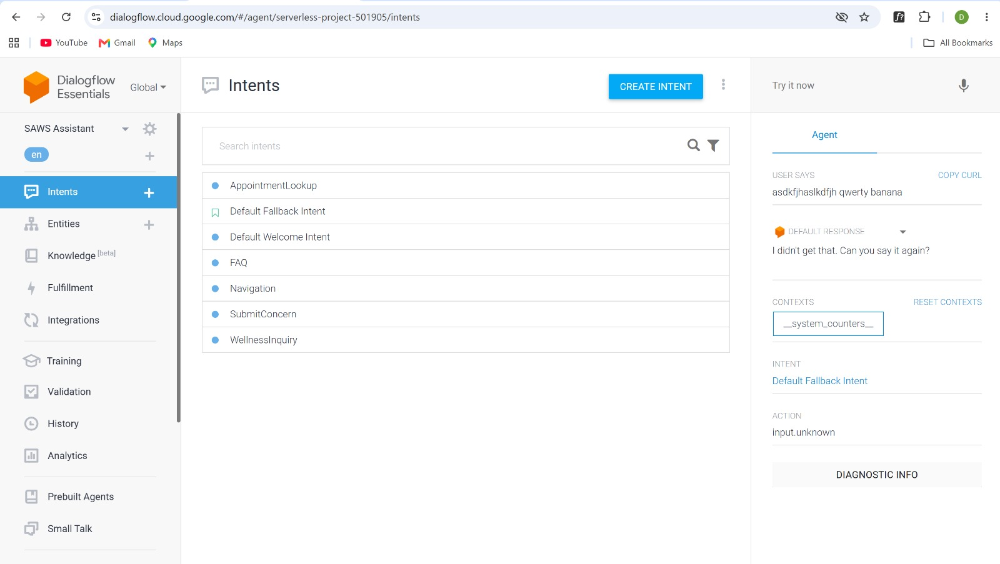

**"What's your cancellation policy?" → `FAQ`, `topic: cancellation`** (this topic had zero tagged training phrases before Sprint 3):

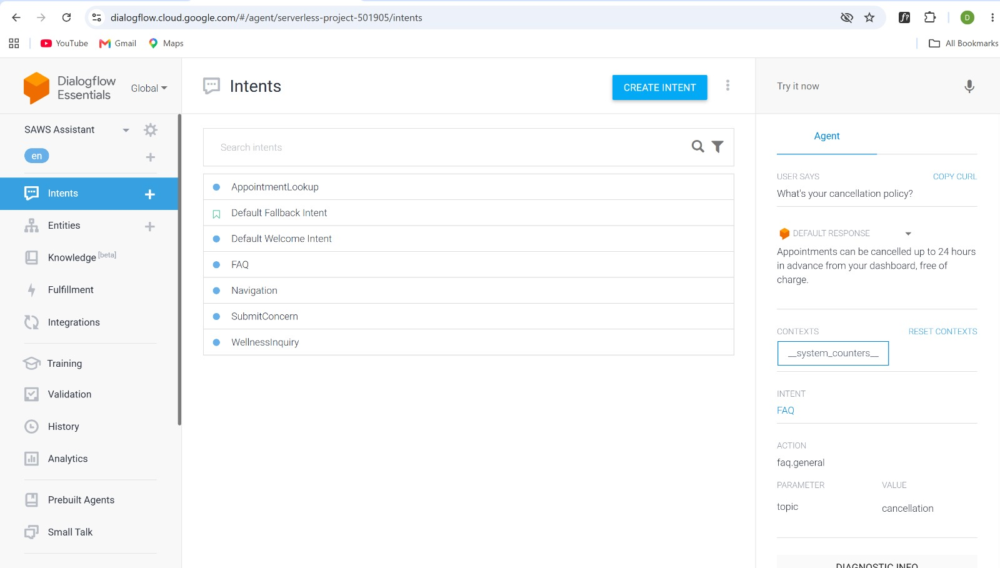

**"I'd like to talk to a counsellor" → `WellnessInquiry`, `serviceType: mental-health`** (new synonym):

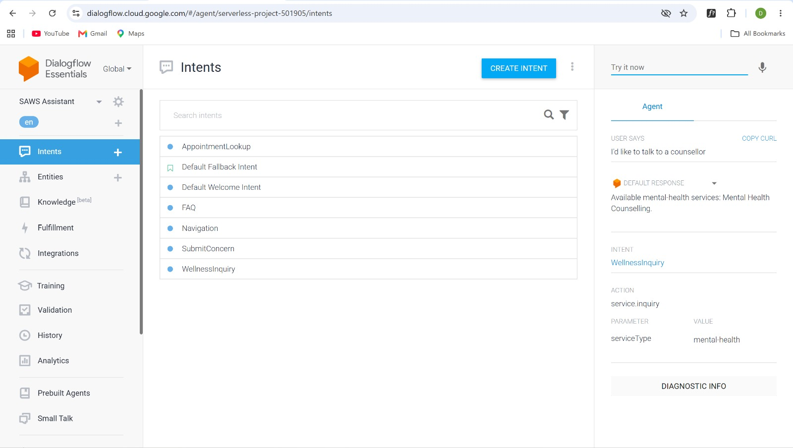

**2. Fulfillment function redeployed with the `index.js` fix**

`terraform apply` was blocked all sprint — the shared state bucket
(`saws-terraform-state-gcp`) referenced in `main.tf` doesn't exist in the
project (confirmed 404, not a permissions error), meaning the team has been
applying with local, un-shared Terraform state. Rather than create that
bucket unilaterally (a team environment-convergence decision, not a
one-person call), `saws-chatbot-fulfillment-dev` was redeployed directly via
`gcloud functions deploy` with the exact same runtime/entry-point/env vars
Terraform defines, so a future `terraform apply` (once the state bucket
question is resolved) sees no drift. Deployed successfully; the
`--allow-unauthenticated` re-grant step 403'd (`run.services.setIamPolicy`
needs IAM Admin, Editor role doesn't include it) but the existing public
invoker binding from Sprint 2 was untouched, so the function stayed reachable
throughout.

**Real deploy mistake caught by the logs, not silently swallowed**: the
first deploy attempt ran from the wrong working directory (`messaging/functions`
instead of `chatbot/functions`), pushing the wrong module's code —
`gcloud functions logs read` shows exactly this, and it's honest evidence
worth keeping rather than editing out:

```
E  saws-chatbot-fulfillment-dev  2026-07-26 17:26:21.239  Default STARTUP TCP probe failed 1 time
   consecutively for container "worker" on port 8080. The instance was not started.
   Connection failed with status CANCELLED.
WARNING  saws-chatbot-fulfillment-dev  2026-07-26 17:26:21.137  Container called exit(1).
         saws-chatbot-fulfillment-dev  2026-07-26 17:26:20.718  Function 'fulfillment' is not defined
         in the provided module.
```

Redeployed from the correct directory immediately after; the next entries
confirm the fix:

```
I  saws-chatbot-fulfillment-dev  2026-07-26 17:30:03.794  Starting new instance. Reason:
   DEPLOYMENT_ROLLOUT - Instance started due to traffic shifting between revisions...
I  saws-chatbot-fulfillment-dev  2026-07-26 17:30:08.479  Default STARTUP TCP probe succeeded
   after 1 attempt for container "worker" on port 8080.
```

**The logs also caught something the earlier "service already comes through
resolved" claim glossed over**: `resolveServiceName`'s fallback warning fires
on *every* live `AppointmentLookup` call, including ones where the output is
already correct:

```
resolveServiceName: no Firestore services doc matches "Physiotherapy" by serviceId or doc ID -- returning it as-is
resolveServiceName: no Firestore services doc matches "Sports Physiotherapy" by serviceId or doc ID -- returning it as-is
```

This confirms the services-catalog cross-cloud mirror gap flagged in
`index.js`'s comments is real and currently active in production, not
theoretical — the output is correct today only because the mirror happens to
already write display names rather than raw IDs, not because there's an
actual `serviceId` → name linkage. Worth a follow-up issue so this isn't
silently relying on that coincidence.

Tested directly against the live function:

| referenceCode | Firestore doc shape | Response |
|---|---|---|
| `APT-DEMO-1` | seeded stub (has `time`, name already) | "Appointment APT-DEMO-1: Sports Physiotherapy on 2026-07-20 at 10:00. Status: CONFIRMED." |
| `APT-1001` | **real mirrored production data** — no `time` field | "Appointment APT-1001: Physiotherapy on 2026-07-02. Status: APPROVED." — no "at undefined", confirms the fix works against actual mirror output, not just the Jest fixtures |


This is also the real-booking verification that depended on Member 2/3's
mirror pipeline — it turned out to already be live and populated
(`APT-1001` through `APT-1007` in Firestore), so this was confirmed directly
rather than needing a fresh test booking.

**3. Coordinators seeded, concern path verified reaching `OPEN`**

`node seed_coordinators.js` seeded 3 coordinators (2 available). Submitted a
concern via the live `SubmitConcern` intent through `detectIntent`, then
checked Firestore `communicationLogs` for the resulting doc — confirmed
twice, once via a scripted `detectIntent` call and once through the console
"Try it now" panel:

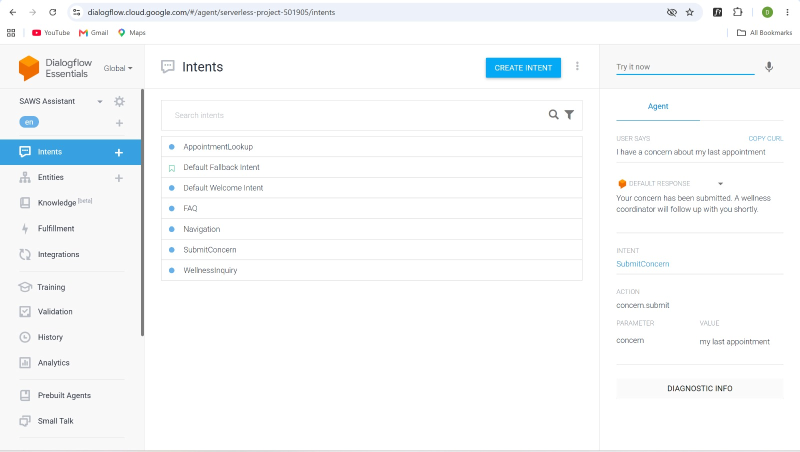

Resulting Firestore document (`communicationLogs/YmPc6Gtg17FYRhGWGkCm`):

```json
{
  "concern": "my last appointment",
  "coordinatorId": "xgKXTK7PzPDVWCzYsoLO",
  "status": "OPEN",
  "createdAt": "July 26, 2026 at 3:12:55 PM UTC-3"
}
```

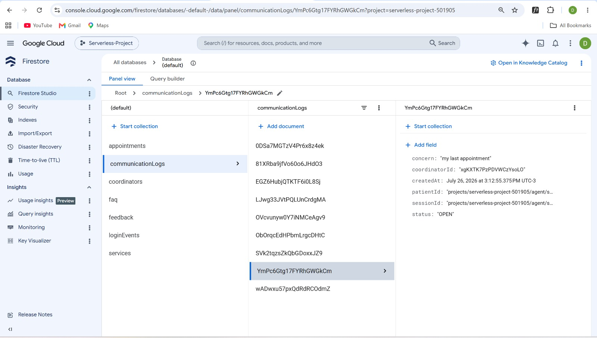

`status: OPEN` with a real `coordinatorId` — confirmed, not `UNASSIGNED` (the
only prior evidence). Several other real `communicationLogs` docs were
already present in the collection from earlier scripted verification and
from what looks like Member 6's Playwright E2E smoke tests
(`pwtest-...@example.com` patient IDs), independently confirming the same
path works.

**Known pre-existing quirk, not introduced by Sprint 3 changes:** the
`concern` parameter only extracted "I" from a longer sentence
("I have a concern, my appointment was double booked...") — a Dialogflow
free-text entity extraction behavior unrelated to anything changed this
sprint, not a regression.

## Outstanding non-blocking item

The Terraform state bucket gap (`saws-terraform-state-gcp` doesn't exist,
team has been applying with local state) is a real issue but bigger than
this module — tracked as a separate GitLab issue for whoever owns
environment convergence, not something this module's Sprint 3 scope blocks
on now that the function's been redeployed directly.

## Running the automated suite

```bash
cd chatbot/functions
npm install
npm test
```
